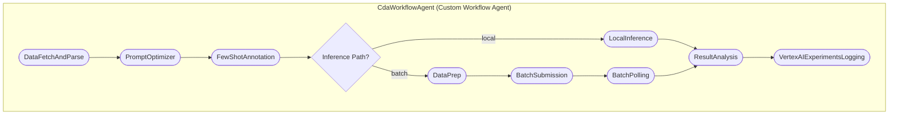

# CDA Dust Analyzer Agent

## Overview

This project demonstrates a multi-agent system designed for the advanced classification and analysis of Cassini's Cosmic Dust Analyzer (CDA) Time-of-Flight mass spectra. The agent is built utilizing the Google Agent Development Kit (ADK) as a standalone scientific study to automate massive scientific dataset analysis. 

It handles the entire data pipeline: from fetching raw datasets dynamically via HuggingFace hub to interactive Few-Shot expert annotation, all the way through to inference processing and metric evaluations. The agent interacts with the powerful Gemini 3.1 Pro API and allows the researcher to choose between synchronous **Local Inference** and asynchronous **Vertex AI Batch Prediction**.

## Agent Details

The key features of the CDA Dust Analyzer Multi-Agent include:

| Feature | Description |
| --- | --- |
| **Interaction Type:** | Headless Workflow & Batch |
| **Complexity:**  | Advanced |
| **Agent Type:**  | Multi Agent |
| **Components:**  | ADK Core Tools, Dynamic Pipeline Processing, Few-Shot RAG, Human-in-the-Loop Feedback |

### Architecture

### Key Features

* **Multi-Agent Architecture:** Utilizes a top-level custom `CdaWorkflowAgent` orchestrator to seamlessly string together independent data processing, polling, and execution modules with custom logic.
* **Automated Data Fetching:** Built-in integration with HuggingFace Hub to dynamically download, parse, and scale incoming `.parquet` files for standardized agent consumption.
* **Interactive Human-in-the-loop (with Caching):** The `FewShotAnnotationAgent` visually iterates through subset samples, plotting regions of interest using `matplotlib` with **Logarithmic Scale Visualization (`plt.semilogy()`)**. This allows researchers to extract dynamic expert explanations that ground the LLM's multi-shot prompt, specifically focusing on dynamic range features and "Repeating Patterns". Inferences are eagerly saved to a local `.jsonl` cache, permitting instant reloading on subsequent runs without redundant manual annotation.
* **Vertex AI Batch Integration:** Asynchronous pipeline logic to bundle thousands of mass spectrometer readings into `jsonl` payloads, submitting jobs to Google Cloud, polling for completion, and automatically executing `ResultAnalysis`.
* **Dynamic Results Reporting:** Analyzes incoming JSON model structures, maps back target ID `sclk` arrays, and generates granular **Multiclass Metrics** (Precision/Recall/F1 for specific classes, rather than binary classification) alongside explicit reasoning into `results.csv`.
* **Automated Feature Research:** Includes an offline pipeline to recursively refine `SYSTEM_INSTRUCTION_TEXT` via model-driven feedback loops, ensuring that the production prompts are strictly tuned to detect structures like periodic vertical repetitions for robust Class 4 classification.
* **ADK Web GUI:** Offers a user-friendly UI development server for real-time interaction, tracking memory state, inputs, and events locally.

## Agent Setup and Installation

### Prerequisites

*   **Google Cloud Account:** Configured access to the Vertex AI API (Gemini 3.1 Pro). You must have Application Default Credentials configured.
*   **Python 3.10+:** Ensure you have Python 3.10 or a later version installed.
*   **uv:** Install the astral `uv` package manager by following the instructions on the official uv website:
    [https://docs.astral.sh/uv/getting-started/installation/](https://docs.astral.sh/uv/getting-started/installation/)

### Project Initialization

This agent uses `uv` to manage the environment and dependencies. When you initiate an ADK command using `uv run`, the dependencies defined in `pyproject.toml` are automatically synced and invoked transparently.

## Running the Agent

You can interact with the system via the command line or the UI development server:

### Configuration

The execution of the workflow is entirely controlled via parameters defined in `cda_dust_agent/config.py` (which can also be overridden via `.env`). Key parameters include:
- `inference_path`: Set to `"local"` or `"batch"`.
- `fetch_data`: Set to `True` to force re-downloading parsing data from HuggingFace.
- `test_mode`, `few_shot_n`, `test_n`: Controls sampling quantities for quick local validation.
- `force_new_annotations`: Set to `True` to bypass the cached `jsonl` and force a new Gemini few-shot visual annotation step.

### CLI Interaction

You can run the agent via the command line in either interactive or non-interactive mode.

#### Interactive Mode
```bash
# Sync dependencies and run the agent interactively
uv run adk run cda_dust_agent
```
The agent will start a REPL session and wait for your input. You can type a prompt (e.g., "run analysis") to trigger the workflow.

#### Non-Interactive Mode (Pure Workflow)
To run the agent without manual text input and without creating a file, you can pipe the input command directly to the CLI:

```bash
echo "run analysis" | uv run adk run cda_dust_agent
```
> [!IMPORTANT]
> Make sure to update `cda_dust_agent/config.py` (or set environment variables) with your desired preferences (e.g., `test_n`, `inference_path`) before running, as the agent will execute immediately based on those settings.

The agent will receive the command, execute the workflow, and exit automatically upon completion.

### ADK Web Interface
```bash
# Host the UI development server
uv run adk web
```
You can access the chat interface at `http://127.0.0.1:8000`.

## Folder Structure

A brief overview of the high-level structures in this repository:

- `cda_dust_agent/`: Contains the core ADK agent components.
  - `agent.py`: Defines the root agent (`CdaWorkflowAgent`) that ADK expects.
  - `sub_agent/`: Contains the sub-agents and the workflow definition (`workflow.py`).
  - `config.py`: Configuration settings using Pydantic, pulling from environment variables.
  - `prompts.py`: Houses the core classification definitions and user prompts.
  - `tools/`: Supportive scripts like `utils.py` for dynamic image plotting, few-shot prompt construction, and JSON structure management.
  - `data/`: Contains project data organized by pipeline stages (`raw/`, `input/`, `output/`, `results/`).
- `Notebooks/`: Contains raw experimental data exploration and parsing scratchpads.
- `scripts/`: Contains various scripts used in the development process, including updating the README.md file with the latest agent diagram.