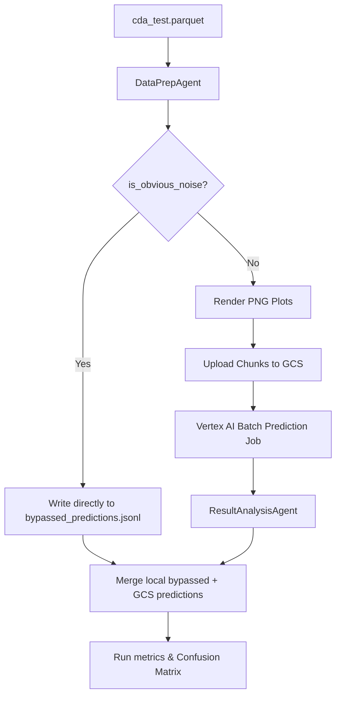

# Stage 1 Gating Pre-Filter Methodology

To scale the Cassini Cosmic Dust Analyzer (CDA) classifier to large datasets (~18K test spectra) while reducing API inference costs and computational overhead, we implemented a **Stage 1 Gating Pre-Filter** in the data preparation pipeline. 

---

## 1. Background & Rationale
Evaluating visual-language models (VLMs) on large datasets can lead to significant API costs and latency. In the Cassini CDA dataset:
* **~66% of the ground truth dataset consists of "Noise"** (pure instrument digitizer grass or empty sweeps).
* Obvious noise is visually flat, devoid of chemical envelopes (like organic carbon spacing or water hydronium combs), and lacks physical cation peaks.
* By identifying and bypassing these obvious noise spectra in Python prior to VLM rendering and API submission, we can reduce Vertex AI Batch API costs and processing time by **up to 65%**.

---

## 2. Pre-Filter Mathematical & Statistical Rules
To ensure that we do not lose classification quality, the Stage 1 Gating pre-filter must be **100% safe (0% False Negatives)**—meaning no genuine chemical grain (Class 1-5, 3-P, 5-Na) is ever misclassified as Noise and bypassed.

A spectrum $S$ (630 channels) with target charge $Q$ (coulombs) is classified as **obvious noise** if it meets either of the following conditions:

### Condition A: Extremely Flat Baseline Range
The spectrum is smoothed using a rolling mean window of 15 channels to filter out high-frequency grass. The range of this smoothed signal is computed:
$$R_{smoothed} = \max(S_{smoothed}) - \min(S_{smoothed})$$

If the range of the smoothed signal is extremely flat:
$$R_{smoothed} < 0.075$$
It is classified as Noise. (Since the lowest-signal chemical grains in the training set exhibit a minimum smoothed range of $0.080$).

### Condition B: Absence of Valid Peaks & Negligible Charge
Using `scipy.signal.find_peaks` on the inverted spectrum $1.0 - S$ (since peaks in the raw data are negative-going, pointing down towards 0):
* **Height threshold ($h$):** $0.20$ (drops below $0.80$ y-value).
* **Prominence threshold ($p$):** $0.08$ (local drop relative to grass floor).
* **Width threshold ($w$):** $\ge 1$ channel.
* **Exclusion region:** Exclude peaks at channels $<20$ or $>620$ (common digitizer sweep artifacts).

If:
1. The count of valid peaks is $0$.
2. The target impact charge $Q < 1.0 \times 10^{-15} \text{ C}$ (1 fC).

Then the spectrum is classified as Noise.

---

## 3. Parameter Calibration
We calibrated these parameters by running a grid search over the 116 training samples (which contain a balanced mix of Noise and all 7 chemical classes). 

**Search bounds:**
* Smooth window: 15
* Range threshold ($r_{thresh}$): $[0.05, 0.09]$
* Height threshold ($h_{thresh}$): $[0.20, 0.30]$
* Prominence threshold ($p_{thresh}$): $[0.08, 0.15]$
* Charge threshold ($q_{thresh}$): $[1.0 \times 10^{-15}, 3.0 \times 10^{-15} \text{ C}]$

### Calibration Results:
The search returned the following optimal parameters for **100% safety (0.00% False Negatives on training set)**:
* `range_thresh`: 0.075
* `zero_peak_range_thresh`: 0.14
* `height_thresh`: 0.20
* `prom_thresh`: 0.08
* `width_thresh`: 1
* `max_charge_thresh`: $1.0 \times 10^{-15} \text{ C}$

---

## 4. Pipeline Integration Architecture

The pre-filter is integrated seamlessly across two sub-agents:



### A. Data Preparation Stage (`DataPrepAgent`)
1. Filters the incoming Parquet test set.
2. If `is_obvious_noise` returns `True`, it outputs a mock VLM response JSON block to `cda_dust_agent/data/output/bypassed_predictions.jsonl`:
   ```json
   {"response": {"candidates": [{"content": {"parts": [{"text": "{\n  \"id\": \"1519594033\",\n  \"class\": \"Noise\",\n  \"explanation\": \"Bypassed by Stage 1 peak detection pre-filter (flat quiet baseline, no physical peaks).\"\n}"}]}}]}}
   ```
3. If `is_obvious_noise` returns `False`, it renders the spectrum image and places the request into the Vertex AI GCS input chunk queue.

### B. Result Analysis Stage (`ResultAnalysisAgent`)
1. Downloads the VLM predictions output folder from GCS.
2. Checks if the local `bypassed_predictions.jsonl` file exists.
3. If present, it appends those lines directly to the main `predictions.jsonl` output file before running evaluations.
4. Computes accuracy, F1 metrics, andconfusion matrices over the merged set.
